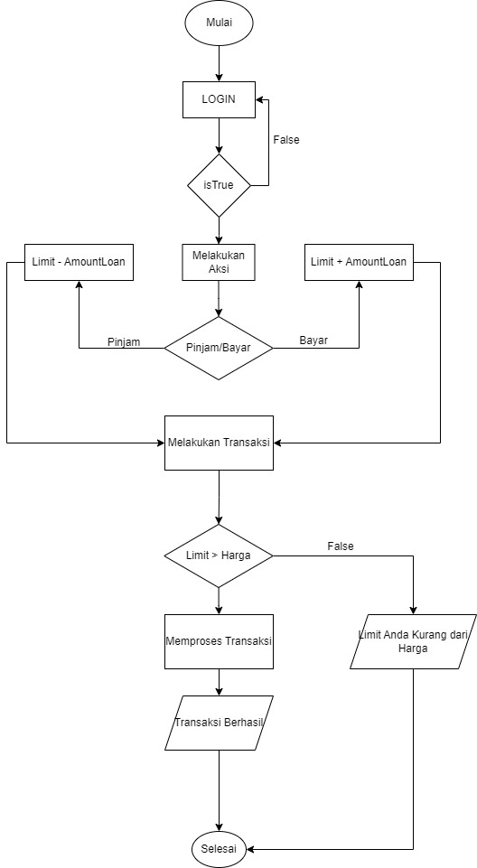
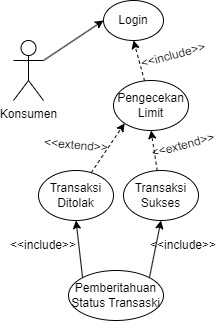
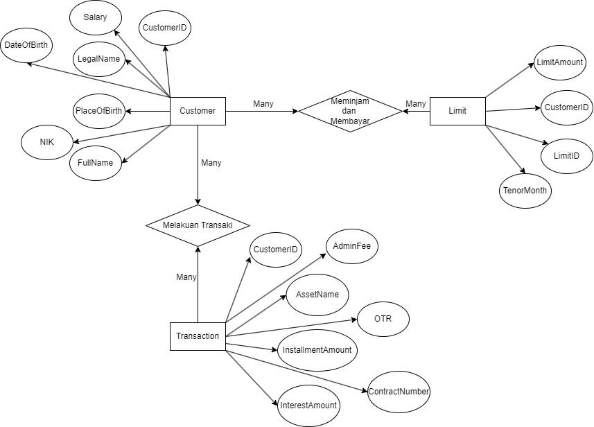

# Jawaban Soal Test
### 1. FlowChart

### 2. Use Case 

### 2. ERD

### Jalankan Dengan Perintah :
    go run main.go

### dokumentasi API :
https://documenter.getpostman.com/view/13641276/2s9YR6ZtqN